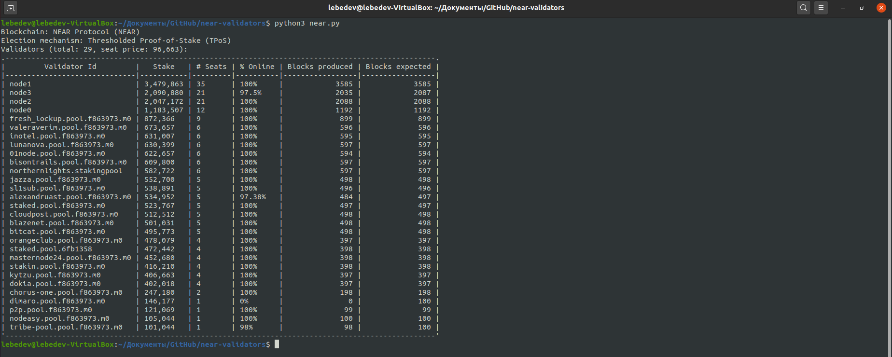

# NEAR Blockchain Validators

## Project description
The program displays information about the current validators of the NEAR blockchain. Program uses near-cli. It is a NodeJS command line interface that utilizes near-api-js to connect to and interact with the NEAR blockchain.

## Build
Make sure you have a current version of `npm` and `NodeJS` installed.

Install near-cli globally by running:

```bash
sudo npm install -g near-cli
```

## Run
To get list of validators:

```bash
python3 near.py
```

## An example of working the program


